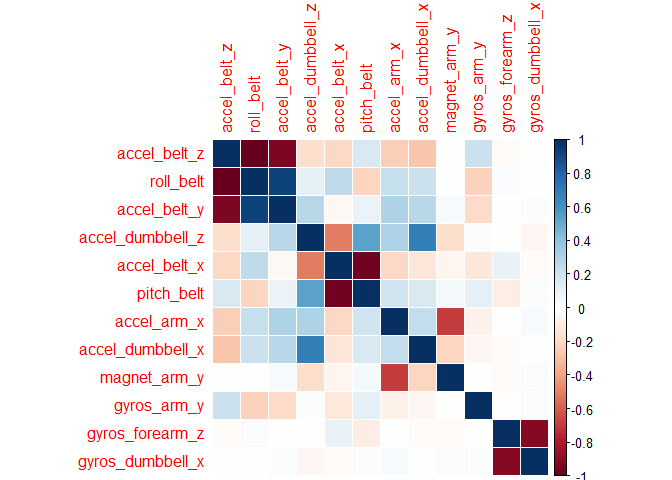
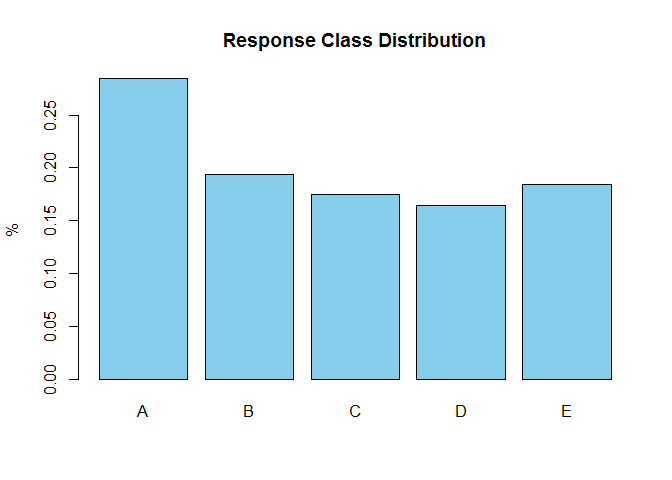
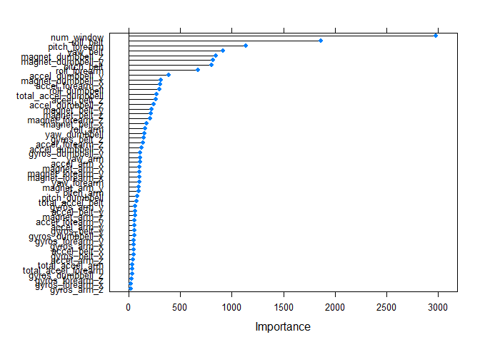

# PML_Project
Dinesh SR  
July 17, 2016  


## Prediction of exercise class using accelerometer readings

###Executive Summary
This objective of this classification exercise is to predict the classes of exercise using measurements of accelerometer attached to the body of subjects. The different classes indicate if the subject had followed the instructions correctly or not, and if they haven't, then the different types of incorrect procedures. More details can be found at http://groupware.les.inf.puc-rio.br/har. The given data was cleaned up, transformed, partitioned and different classifers were fit with varying levels of accuracy. The best classifier, chosen based on out-of-sample accuracy on the hold-out set was used to predict the class of 20 test set records required

### Data Preparation and Pre-processing
1. Load the datasets and examine them

```r
# Download data from given URLs
if (!file.exists("pmldata")) {dir.create("pmldata")}
fileUrl1 = "https://d396qusza40orc.cloudfront.net/predmachlearn/pml-training.csv"
fileUrl2 = "https://d396qusza40orc.cloudfront.net/predmachlearn/pml-testing.csv"
download.file(fileUrl1, destfile = "./pmldata/pml-training.csv",mode = "wb")
download.file(fileUrl2, destfile = "./pmldata/pml-testing.csv",mode = "wb")
dateDownloaded = date()
data = read.csv("./pmldata/pml-training.csv",stringsAsFactors = FALSE)
testing = read.csv("./pmldata/pml-testing.csv",stringsAsFactors = FALSE)
#str(data)
#summary(data)
#head(data)
dim(data);dim(testing)
```

```
## [1] 19622   160
```

```
## [1]  20 160
```
***Remarks:-***  
Raw data and testing datasets have been loaded and have **160** varibles each

2. Clean/tranform the data into a format suitable for analysis

```r
# Load the libraries
library(caret)
library(caretEnsemble)
library(corrplot)
library(doParallel)

# Remove missing data
pMiss = function(x){sum(is.na(x)|x=="")/length(x)*100}
missing = which(apply(data,2,pMiss)>95)
data = data[,-missing]
# Remove near zero variance data
nzv = nearZeroVar(data,saveMetrics = TRUE)$nzv
data = data[,-which(nzv)]
# Remove non-relevant data
data$X = NULL
data$raw_timestamp_part_1 = NULL
data$raw_timestamp_part_2 = NULL
data$cvtd_timestamp = NULL
data$user_name = NULL
data$new_window = NULL
# Tranform the response variable
data$classe = as.factor(data$classe)
dim(data)
```

```
## [1] 19622    54
```

```r
# calculate correlation matrix
corrM <- cor(data[,-54])
# find attributes that are highly corrected (>=0.8)
highlyCorrelated <- findCorrelation(corrM, cutoff=0.8)
corrHC <- cor(data[,highlyCorrelated])
# plot highly correlated variables
corrplot(corrHC,method = "color")
```



```r
# Split given data into training and validation sets
set.seed(123)
inTrain = createDataPartition(data$classe, p = 3/4)[[1]]
training = data[ inTrain,]
validate = data[-inTrain,]
dim(training);dim(validate)
```

```
## [1] 14718    54
```

```
## [1] 4904   54
```

```r
# Transform training data variables using principal component analysis
preProc = preProcess(training[,-54],method = "pca",thresh=0.99)
trainPCA = predict(preProc,training[,-54])
validPCA = predict(preProc,validate[,-54])
dim(trainPCA);dim(validPCA)
```

```
## [1] 14718    37
```

```
## [1] 4904   37
```

```r
# Retrofit the changes and sync-up testing data set
testing = testing[,-missing]
testing = testing[,-which(nzv)]
testing$X = NULL
testing$raw_timestamp_part_1 = NULL
testing$raw_timestamp_part_2 = NULL
testing$cvtd_timestamp = NULL
testing$user_name = NULL
testing$new_window = NULL
testing$problem_id = NULL
testPCA = predict(preProc,testing)
dim(testPCA)
```

```
## [1] 20 37
```

***Remarks:-***   

+ Data variables with substantial(>95%) missing values were removed. This reduced the number of variables to 60 from 160
+ Variables with near zero variance were removed reducing the count to 59
+ Variables quite unlikely to influence accelorometer readings like user name, time stamp etc were removed further reducing the variable count to 54
+ And to get rid of the substantial number of variables who were highly correlated and also to normalize variables to same scale, principal component analysis was applied with a threshold value of 0.99 which yielded 37 orthogonal vectors which accounted for 99% of the variance
+ All of the above changes were applied to testing data set to standardize the variables
+ The given data was split into training and validation sets at a ratio of 75:25 to fit the models and verify their out-of-sample accuracy

### Model fitting and Analysis

```r
# Check the distribution of the response variable
barplot(prop.table(table(data$classe)),col = "skyblue",main="Response Class Distribution",ylab = "%")
```



```r
# Register for parallel processing
cl = makeCluster(detectCores(), type='PSOCK')
registerDoParallel(cl)
# Initialise training control parameters
ctrl <- trainControl(method = "cv",
                     number=10,
                     classProbs = TRUE,
                     allowParallel=TRUE)

# Fit a linear discriminant model to the training data
set.seed(123)
modelFitLDA = train(training$classe ~ .,
                     method = "lda",
                     data = trainPCA,
                     trControl = ctrl)
# Verify in-sample accuracy
modelFitLDA$results
```

```
##   parameter  Accuracy     Kappa AccuracySD    KappaSD
## 1      none 0.6261671 0.5273964  0.0119186 0.01520758
```

```r
# Verify out-of-sample accuracy
predictLDA = predict(modelFitLDA,newdata=validPCA)
accuracyLDA = confusionMatrix(validate$classe , predict(modelFitLDA,validPCA))
round(accuracyLDA$overall,digits = 2)
```

```
##       Accuracy          Kappa  AccuracyLower  AccuracyUpper   AccuracyNull 
##           0.62           0.52           0.60           0.63           0.29 
## AccuracyPValue  McnemarPValue 
##           0.00           0.00
```

```r
# Fit a random forest model to the data
set.seed(123)
modelFitRF = train(training$classe~.,
                data=trainPCA,
                method = "rf",
                ntree=500,
                nodesize=1,
                trControl = ctrl)
# Verify in-sample accuracy
modelFitRF$results
```

```
##   mtry  Accuracy     Kappa  AccuracySD     KappaSD
## 1    2 0.9814507 0.9765274 0.002058660 0.002609516
## 2   19 0.9774425 0.9714569 0.003946949 0.004996828
## 3   37 0.9732298 0.9661263 0.004511772 0.005712913
```

```r
# Verify out-of-sample accuracy
predictRF = predict(modelFitRF,newdata=validPCA)
accuracyRF = confusionMatrix(validate$classe , predict(modelFitRF,validPCA))
round(accuracyRF$overall,digits = 2)
```

```
##       Accuracy          Kappa  AccuracyLower  AccuracyUpper   AccuracyNull 
##           0.98           0.98           0.98           0.98           0.29 
## AccuracyPValue  McnemarPValue 
##           0.00            NaN
```

```r
# Fit a gradient boosting model
set.seed(123)
modelFitGBM =  train(training$classe ~ .,
                     method = "gbm",
                     data=trainPCA,
                     verbose = FALSE,
                     trControl = ctrl)
# Verify in-sample accuracy
modelFitGBM$results
```

```
##   shrinkage interaction.depth n.minobsinnode n.trees  Accuracy     Kappa
## 1       0.1                 1             10      50 0.6250176 0.5193162
## 4       0.1                 2             10      50 0.7136813 0.6355973
## 7       0.1                 3             10      50 0.7685808 0.7060737
## 2       0.1                 1             10     100 0.6820899 0.5948289
## 5       0.1                 2             10     100 0.7804694 0.7213701
## 8       0.1                 3             10     100 0.8342171 0.7898207
## 3       0.1                 1             10     150 0.7158551 0.6386728
## 6       0.1                 2             10     150 0.8181791 0.7694556
## 9       0.1                 3             10     150 0.8623439 0.8256306
##   AccuracySD    KappaSD
## 1 0.01306126 0.01679342
## 4 0.01324695 0.01698667
## 7 0.01298674 0.01668045
## 2 0.01285454 0.01645560
## 5 0.01151594 0.01467525
## 8 0.01118065 0.01433059
## 3 0.01520729 0.01936999
## 6 0.01130835 0.01457371
## 9 0.01209068 0.01544459
```

```r
# Verify out-of-sample accuracy
predictGBM = predict(modelFitGBM,newdata=validPCA)
accuracyGBM = confusionMatrix(validate$classe , predict(modelFitGBM,validPCA))
round(accuracyGBM$overall,digits = 2)
```

```
##       Accuracy          Kappa  AccuracyLower  AccuracyUpper   AccuracyNull 
##           0.85           0.81           0.84           0.86           0.29 
## AccuracyPValue  McnemarPValue 
##           0.00           0.00
```

```r
# Compare accuracy of models
model_list = list(LDA = modelFitLDA,RF  = modelFitRF,GBM = modelFitGBM)
resamps = resamples(list(LDA = modelFitLDA,
                         RF  = modelFitRF,
                         GBM = modelFitGBM))
summary(resamps)
```

```
## 
## Call:
## summary.resamples(object = resamps)
## 
## Models: LDA, RF, GBM 
## Number of resamples: 10 
## 
## Accuracy 
##       Min. 1st Qu. Median   Mean 3rd Qu.   Max. NA's
## LDA 0.6071  0.6160 0.6298 0.6262  0.6331 0.6445    0
## RF  0.9782  0.9805 0.9817 0.9815  0.9830 0.9837    0
## GBM 0.8396  0.8570 0.8669 0.8623  0.8688 0.8771    0
## 
## Kappa 
##       Min. 1st Qu. Median   Mean 3rd Qu.   Max. NA's
## LDA 0.5025  0.5149 0.5323 0.5274  0.5357 0.5506    0
## RF  0.9725  0.9753 0.9768 0.9765  0.9785 0.9794    0
## GBM 0.7967  0.8187 0.8314 0.8256  0.8339 0.8445    0
```

```r
# Compare ratio of prediction matches
accuClass = function(values,prediction)
{sum(prediction == values)/length(values)}
accuClass(predictRF,predictLDA)
```

```
## [1] 0.629894
```

```r
accuClass(predictGBM,predictLDA)
```

```
## [1] 0.6865824
```

```r
accuClass(predictRF,predictGBM)
```

```
## [1] 0.8666395
```

```r
# Compare model correlation
modelCor(resamps)
```

```
##           LDA        RF       GBM
## LDA 1.0000000 0.2723426 0.5664612
## RF  0.2723426 1.0000000 0.3808947
## GBM 0.5664612 0.3808947 1.0000000
```

```r
# Model stacking
predDF = data.frame(predictRF,predictGBM,classe = validate$classe)
combmodFit = train(classe ~ .,method = "rf",data=predDF,prox = TRUE)
combPred = predict(combmodFit,predDF)
accuracyCOMB = confusionMatrix(validate$classe, combPred)
round(accuracyCOMB$overall,digits = 2)
```

```
##       Accuracy          Kappa  AccuracyLower  AccuracyUpper   AccuracyNull 
##           0.98           0.98           0.98           0.98           0.29 
## AccuracyPValue  McnemarPValue 
##           0.00            NaN
```

***Remarks:-***   

+ The types and distribution of response variable **classe** was examined thru a barplot. There were five distinct classes A,B,C,D,E and the distribution seemed fairly proportionate for all classes barring A which was the dominant class
+ Considering the nearly balanced classes and also the multiplicity of classes, three popular classifiers namely **Linear Discriminant Analysis, Random Forests, Gradient Boosting Method** were chosen for model fitting exercise. Decision trees is not required as we are concerned with model prediction accuracy rather than interpretability while other popular classifiers like logistic regression and SVM were not considered since they are more suited to binary classification scenarios. Naive Bayes method wasn't considered given the highly correlated nature of data 
+ Resampling with 10 fold cross validation method was used to train the models on training set **trainPCA**. The hold out dataset **validPCA** was used to assess the out-of-sample variance of the models. Since the distribution of response class was fairly balanced, **Accuracy** measure was used to compare the performances both in- sample and out-of-sample. 
+ Random forest model had the best  in-sample/out-of-sample accuracy of 98% while GBM predictions were about 86% accurate and LDA had an accuracy of only 63% indicating that the response/predictor relation was more non-linear in nature
+ Further tests were carried out to compare the prediction matches across models and also their correlation. 
+ The two best performing models RF and GBM were stacked together and an ensemble model was fitted using RF classifier to check for any further improvement in prediction accuracy. The ensemble model also had only 98% accuracy on out-of-sample prediction

### Final Model Selection and Test Set Class Prediction

```r
# Fit the final model using full data and predictor set
set.seed(123)
modelFitBest = train(classe~.,
                data=data,
                method = "rf",
                ntree=500,
                nodesize=1,
                trControl = ctrl)
# estimate variable importance
importance = varImp(modelFitBest, scale=FALSE)
# plot importance
plot(importance)
```



```r
# Predict Class of Test data
predictTest = predict(modelFitBest,newdata=testing)
predictTest
```

```
##  [1] B A B A A E D B A A B C B A E E A B B B
## Levels: A B C D E
```

```r
#Stop parallel cluster
stopCluster(cl)
```

***Remarks:-***   

+ Given that random forest model and ensemble model had a similar out-of-sample accuracy rate of 98%, the simpler one random forest model was chosen as the best model to do the final test data prediction
+ The final model was fit using RF with the full original data and all 53 predictors and it had an in sample accuracy of 99.86%
+ The variable importance ranking of the predictors was verified
+ The final model was used to predict the class of 20 untouched test set data.The class predictions were submitted to Prediction Project Quiz and had an accuracy of 100% 
